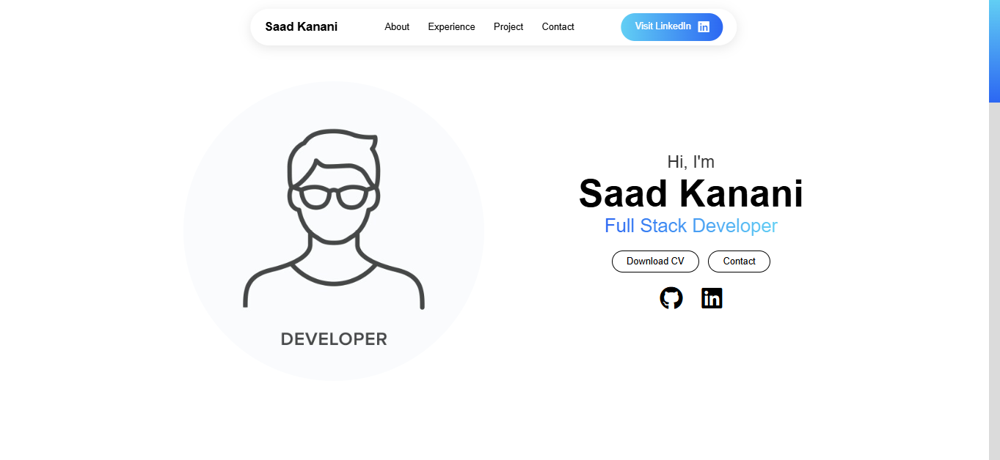

## Saad Kanani - Full Stack Developer Portfolio

Portfolio website built using HTML5, CSS3, JavaScript, and a few additional libraries for interactive features.

<a href="https://your-portfolio-link.com" target="_blank">**Visit Now** 🚀</a>

## 📌 Tech Stack
&nbsp;
&nbsp;

## 📌 Sneak Peek of Main Page 🙈:

## 📬 Contact

Feel free to reach me through the handles below if you'd like to get in touch!

  
